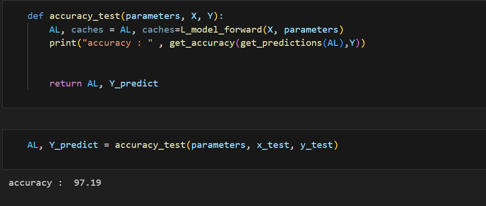
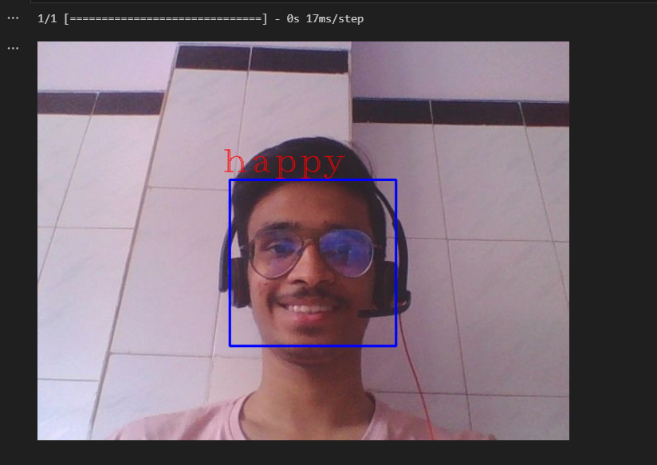
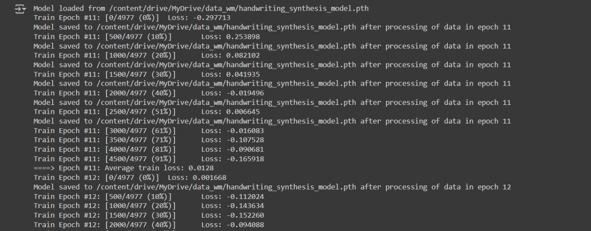
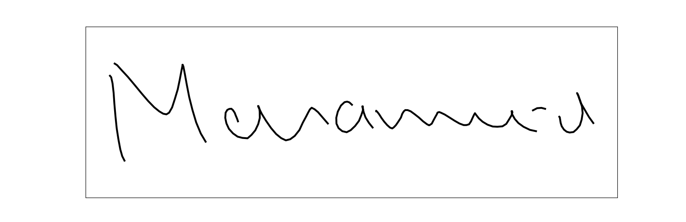
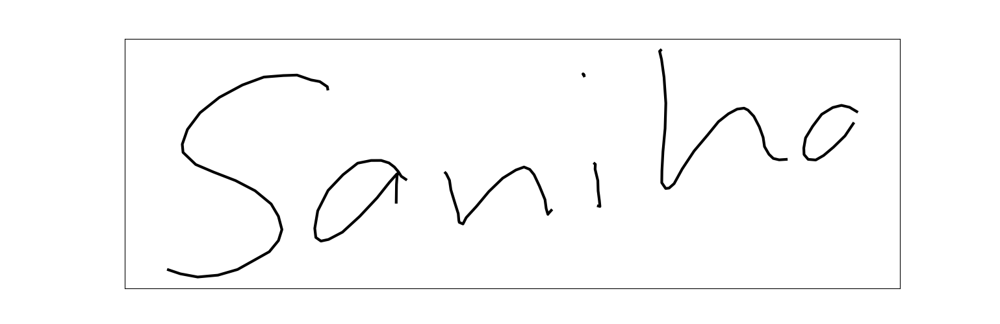

# Write-mate

## Aim

The goal of this project is to develop a system that utilizes a neural network, specifically based on [Long Short Term Memory (LSTM)](https://colah.github.io/posts/2015-08-Understanding-LSTMs/) and the attention mechanism, to generate handwriting from input text.

## Description

This project implements the concepts from Alex Graves' 2014 paper, [Generating Sequences With Recurrent Neural Networks](https://arxiv.org/abs/1308.0850). The model processes input text and outputs realistic handwriting by employing stacked LSTM layers coupled with an attention mechanism.

# Mini Projects

During our learning phase, we engaged in Coursera courses by Andrew Ng on [Deep learning Specialization](https://www.coursera.org/specializations/deep-learning).

- We studied Neural Networks and Optimization methods, using our knowledge to create a Handwritten Digit Recognition model from scratch with the MNIST dataset, achieving impressive accuracy.
  

- We explored Convolutional Neural Networks (CNNs) and various architectures. Utilizing ResNet18 and ResNet50 architectures, we developed a Facial Emotion Recognition model with the FER2013 dataset to detect a person's mood from images.
  

### LSTM:

LSTM networks can generate complex sequences with long-range structure by utilizing their memory cells to store information, making them adept at identifying and leveraging long-range dependencies in data.

### Attention-mechanism

Handwriting involves longer sequences and more points than text, requiring the model to generate multiple points per character. The attention mechanism assists by creating a soft window that dynamically aligns the text with pen locations, helping the model determine which character to write next.

### Mixture Density Network (MDN)

Mixture Density Networks can quantify their uncertainty and capture the randomness of handwriting. They output parameters for several multivariate Gaussian components, including mean (μ), standard deviation (σ), and correlation (ρ), as well as weights (π) to gauge each distribution's contribution to the final output.

# WriteMate Model Architecture

## Handwriting prediction

This component consists of three stacked LSTM layers. The output is fed into a mixture density layer, which provides the mean, variance, correlation, and weights of 20 mixture components. This model explores the handwriting generation capability of the architecture without input text.

## Handwriting synthesis

The model integrates an LSTM layer that receives additional input from the character sequence via the window layer. This creates an LSTM-Attention layer, whose output is then processed through two stacked LSTM layers before reaching the mixture density layer.

The inputs (x, y, eos) are sourced from the [IAM-OnDB online database](https://fki.tic.heia-fr.ch/databases/iam-on-line-handwriting-database), where x and y represent pen coordinates and eos marks points where the pen is lifted off the writing surface.

The output is (x, y, eos) of the hand-writing form of the input text which can be plotted to get the final output.

# Current Implementation

We developed the model using PyTorch, as outlined in the research paper. Despite training for several epochs, the model reached a bottleneck where the loss magnitude ceased to decrease.

Additionally, the output did not meet our expectations and requires further refinement. Here are some of the results we obtained:

- Mohammed
  

- Sanika
  

# Future works

- We plan to enhance the model's accuracy and output quality to generate more realistic handwriting.
- Upon achieving satisfactory results, we aim to deploy the model and create a web interface for public use.

# Contributors

- [Mohammed Bhadsorawala](https://github.com/mohammed052)
- [Sanika Kumbhare](https://github.com/Sanika-k-1317)

# Acknowledgements

- [SRA VJTI](https://sravjti.in/) - Eklavya 2023
- Heartfelt gratitude to our mentors [Lakshaya Singhal](https://github.com/LakshayaSinghal) and [Advait Dhamorikar](https://github.com/advait-0) for guiding us at every point of our journey. The project wouldn't have been possible without them

# Resources

Deep Learning courses

- [Neural Networks and Deep Learning](https://www.coursera.org/learn/neural-networks-deep-learning/home/week/1)
- [Improving Deep Neural Networks: Hyperparameter Tuning](https://www.coursera.org/learn/deep-neural-network/home/week/1)
- [Convolution Neural Network](https://www.coursera.org/learn/convolutional-neural-networks/home/week/1)
- [Sequence model](https://www.coursera.org/learn/nlp-sequence-models/home/week/1)
